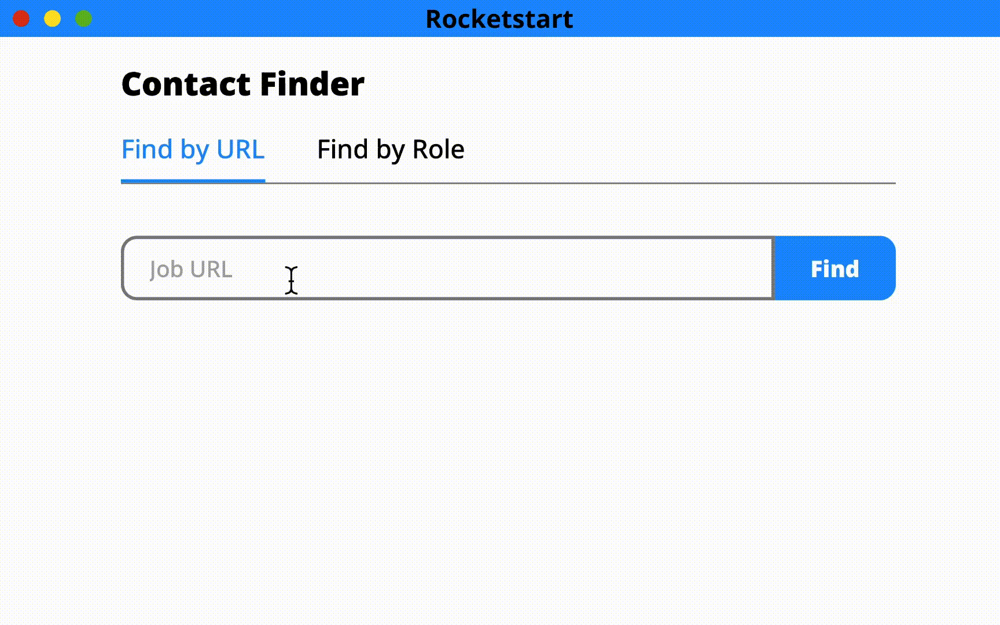

# Rocketstart

Rocketstart is a text analysis tool for LinkedIn connection requests.

## Demo

## Features

- Text analysis tool for writing strong LinkedIn connection messages.
- Authentication (Register/Login/Logout/Change Email || Password)
- Authorization (routes protected with [React Router V6](https://reactrouter.com/en/main))

## Roadmap

- Modify modals to React Portals
- Refactor to leverage Redux Store (if adding new feature) or remove Redux store (if not adding new feature)

## Tech Stack

This project is a MERN (MongoDB, Express, Node, React) application. Due to the simplicity of the product, a rendering framework was not used and Rocketstart is a SPA (single-page application).

This project is also built on [Firebase Authentication](https://firebase.google.com/). Firebase Authentication provides a set of authentication tools to seamlessly log in to a web or mobile app. Firebase is used client-side to protect routes (authorization) and server-side to perform authentication actions.

This project is hosted on a [Render](https://render.com/) server.

The application is styled in vanilla CSS.

#### Other tech used:

- [Redux](https://redux.js.org/) is a library for managing state in a React app.
- [Umami Analytics](https://umami.is/) is a privacy-focused Google Analytics alternative.
- [Netlify](https://www.netlify.com/) is used to deploy the client-side application.
- [MJML](https://mjml.io/) is a markdown language used to create responsive HTML emails.
- [Postmark](https://postmarkapp.com/) is used for transactional authentication emails.

## Notes

#### Why does this project use Redux/Thunk if the client doesn't need a store?

At the time of architecting the app, another feature was in the roadmap that would have used the store. The feature was not developed. I decided to keep the traditional actions/reducers/containers/components structure on the client and the controllers/models/routes structure on the server.

#### Why did I choose not to use a rendering framework?

The purpose of this project was to master the React Library, React Components, and React Hooks. A rendering framework would have detracted from this focus. The product is extremely simple. SEO is not important. Therefore, the application is a SPA.

#### Why did I choose Firebase for Authentication? Why didn't I choose Firebase to store data?

Firebase Authentication fits the needs of the project and is scalable. Firebase Authentication also supports major providers past email/password authentication: Google/Facebook/Apple/Microsoft. This is a feature I plan to implement.

This project is built off of a simple MERN application without authentication. While Firestore might have been simpler to implement with Firebase Authentication, I wanted to stay true to the MERN stack.

#### Is this project complete?

Rocketstart is currently a functional MVP. Users can sign up, use the text analysis tool, and perform basic functions with their account.

A paid feature was briefly considered to allow users the ability to find recruiters/hiring managers based on an input URL. The feature was scrapped because it is built off [Google's Programmable Search Engine](https://developers.google.com/custom-search/v1/site_restricted_api), which doesn't provide an up to date snapshot of LinkedIn data.

#### Why does Rocketstart have analytics if it's a SPA?

I implemented Umami for the experience of building an analytics tool on a website. I chose not to use Google Analytics to protect user privacy. I used Umami to track the website growth during the week I advertised the product to job seekers.